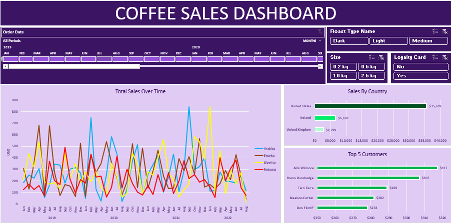

# Coffee Sales Dashboard

## Project Overview

This project analyzes coffee sales data using an interactive Excel dashboard.  
The goal is to understand customer purchasing behavior, product performance, and sales trends over time.

---

## Dashboard Preview

---

## Key Questions Answered

- How do coffee sales change over time?
- Which coffee types generate the most revenue?
- Which countries contribute the most sales?
- Who are the top customers?
- How do roast types, size, and loyalty cards influence sales?

---

## Key Insights

- The United States generates the highest coffee sales among the analyzed countries.
- Sales trends fluctuate across months, suggesting possible seasonal patterns.
- A small number of customers contribute significantly to overall revenue.
- Different coffee roast types show varying demand levels across time.

---

## Dashboard Features

Interactive filters allow users to explore data by:

- Order Date
- Roast Type
- Package Size
- Loyalty Card Status

---

## Tools Used

- Microsoft Excel
- Data Cleaning
- Data Visualization
- Dashboard Design
